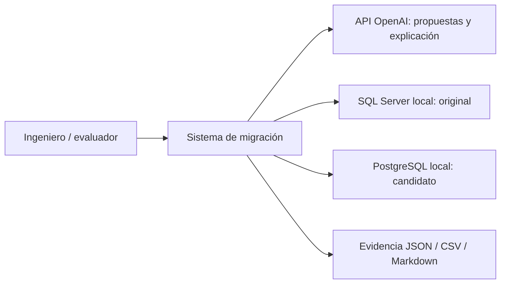
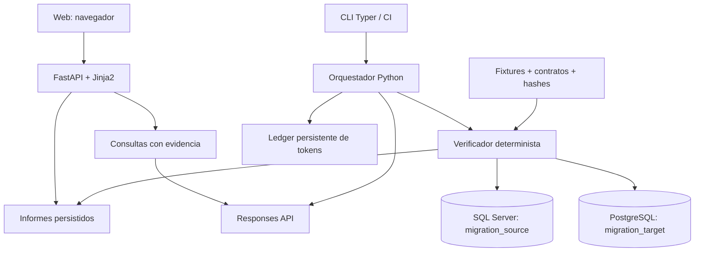

# Arquitectura y límites de confianza

## C4: contexto

## C4: contenedores

## Componentes y flujo

1. Los originales y contratos son creados por el autor y se congelan antes de llamar al modelo.
2. El modelo genera una propuesta estructurada. No recibe credenciales ni herramientas generales de archivos o ejecución.
3. El ejecutor comprueba la política SQL, instala con el rol limitado `candidate`, restaura datos y ejecuta originales y traducción.
4. Un comparador fijo contrasta resultados, errores de negocio y estado de todas las tablas. El LLM no decide igualdad.
5. La técnica directa conserva el primer intento. El agente recibe diferencias de seis casos de corrección y puede producir hasta dos nuevas propuestas.
6. Dos casos reservados por procedimiento se ejecutan, pero nunca entran al contexto de corrección. Pasar los seis casos detiene correcciones incluso si falla un reservado.
7. Informes y trazas alimentan la web y las consultas. Las afirmaciones del modelo se guardan separadas de los veredictos.

## Límites de confianza

El agente no tiene acceso al original ejecutable, al sistema de archivos ni al comparador. Eso reduce la superficie, pero no sustituye la detección. Se registran solicitudes prohibidas, declaraciones de pruebas inventadas y violaciones SQL/permisos. Los hashes detectan alteración de archivos. El usuario PostgreSQL no es superusuario ni dueño de `domain`; puede leer datos de trabajo y escribir solo las tablas autorizadas para el procedimiento actual. El esquema `migration` se elimina entre propuestas.

El verificador es de confianza y posee credenciales administrativas para restaurar datos, que nunca se incluyen en prompts. Un lock de proceso evita que inicialización, comparación y ataques controlados usen los mismos motores simultáneamente. Una segunda evaluación devuelve error si el lock está ocupado. El SQL generado puede usar SQL dinámico y temporales, pero no instalar extensiones ni usar lenguajes no confiables.

La web es una herramienta local: escucha en loopback y Compose publica solo en 127.0.0.1. No es un servicio multiusuario. No monta el socket Docker ni contiene la clave en sus capas. `pymssql` utiliza FreeTDS con wheels, evitando requerir un driver ODBC instalado en el equipo del evaluador.
